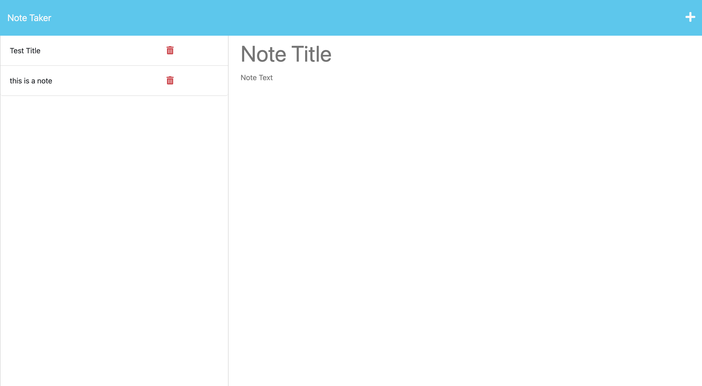

# notekeeper-guide-thingy

## Description
The intention of the Notekeeper Guide Thingy Applicatio is to give usewrs an alternative to the notes app on their phone or computer if their really hankering to get the same app on a browser.

I think what I learned that stuck with me the most is how to and why spreading out routes into their own files is so important and how easy it can be after practice not to mention the headache it will save later development.

## Installation

- To install The Notekeeper Guide Thingy application simply pull the SSH Link from the bright green code button in GitHub.
- Open up your terminal on your local machine and naviage to a directory you would like to store the code for this in type git clone then paste the SSH Link and hit enter.
- Once done you will have the full repo then it is just a matter of changing directories to The Notekeeper Guide Thingy application and using your preffered method for opening it in a code editor.

## Usage

As seen in the picture below the user can start a new note and add whatever text they would like to it along with limited styilng then click the save icon to have it live there essentially as long as they use the application as it then gets stored in our db.json file.

## License

MIT License

## Features

- the user can add notes using the plus button

- the user can delete one at a time using the trash button

- the user can save their work to our db.json file and it will always render when they re-open thye application